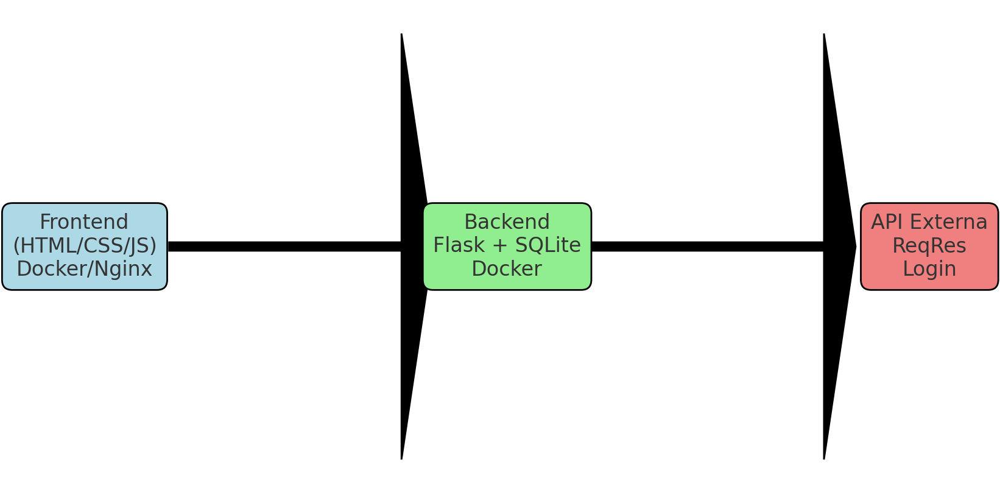

# naFila - Frontend

Interface simples em **HTML, CSS e JavaScript puro**.

## Funcionalidades
- Tela de login (autenticação via API externa ReqRes)
- CRUD de conteúdos consumindo o backend Flask
- Listagem e inclusão de itens

## Como rodar com Docker
```bash
docker build -t nafila-frontend .
docker run -p 8080:80 nafila-frontend
```

Acesse em: [http://localhost:8080](http://localhost:8080)

## Arquitetura

