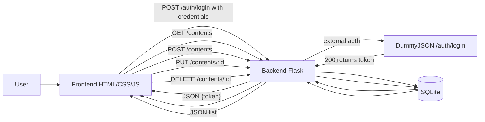

# naFilaPlus — Frontend (HTML/CSS/JS)

Interface evoluída a partir do projeto inicial, atendendo aos requisitos do MVP.

**Principais pontos**
- **Login** contra o backend (DummyJSON no backend).
- **Form** de novo conteúdo.
- **Lista** com filtros.
- **Edição**/**Exclusão**.
- **Barra de progresso** com porcentagem.
- **Drag & Drop** com persistência local (localStorage).
- **Estilo** seguindo classes do projeto base e ajustes visuais.

---

## 💻 Como rodar (Docker)
```bash
docker rm -f nafila-frontend 2>/dev/null || true
docker build -t nafila-frontend .
docker run -d --name nafila-frontend -p 8080:80 nafila-frontend
# Abra: http://localhost:8080
```

> O frontend aponta para `http://SEU_HOST:5000` automaticamente (usa `location.hostname`).

## 🔑 Credenciais de demonstração (para avaliação)
- **username:** `emilys`
- **password:** `emilyspass`

---

## 🧭 Fluxo resumido


---

## 📝 Fluxo de uso sugerido
1. Acesse `http://localhost:8080`.
2. Faça **login** com as credenciais acima.
3. Adicione um conteúdo (título, tipo, status).
4. Edite/Exclua.
5. Use **Concluir** para marcar 100%.
6. Reordene com **drag & drop**.

---

## Observações
- A ordem dos cards é persistida apenas no navegador.
- Garanta que o backend esteja acessível em `:5000` no mesmo host.
